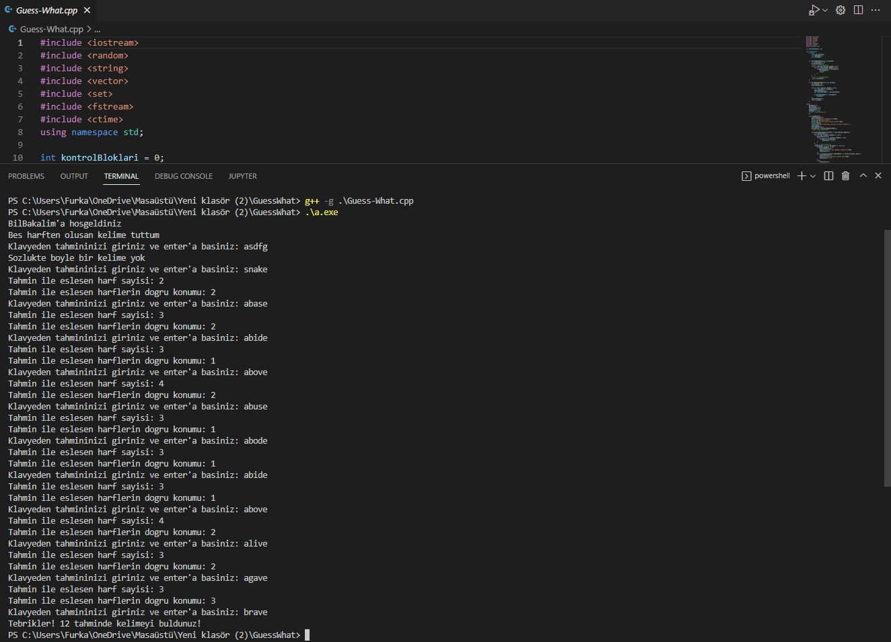

# `GuessWhat`
In this project I developed a simple Guess What game that word guessing game. In order to win the game you need to find the word that chosen by program. The game takes a txt file as dictionary and choose words from there. accepts  User type guesses in command prompt and program returns how close the user guess to correct answer.

## Screenshots

|  |
| :--:|
| *Game Demo* |

